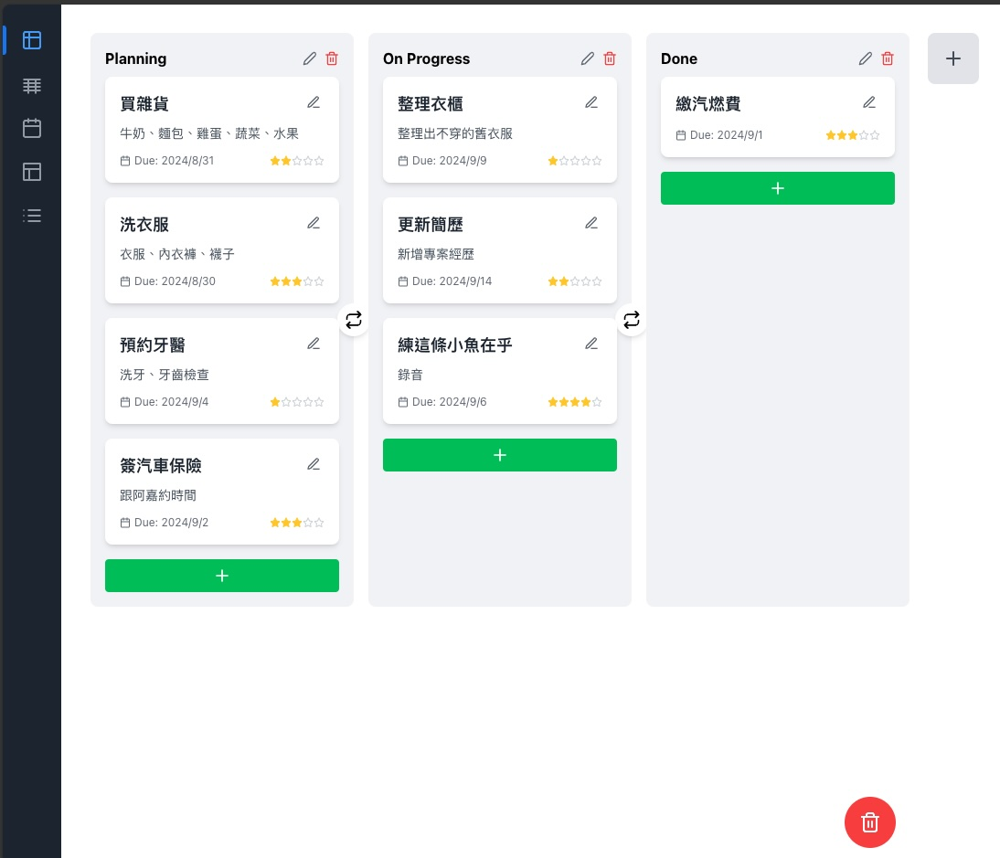
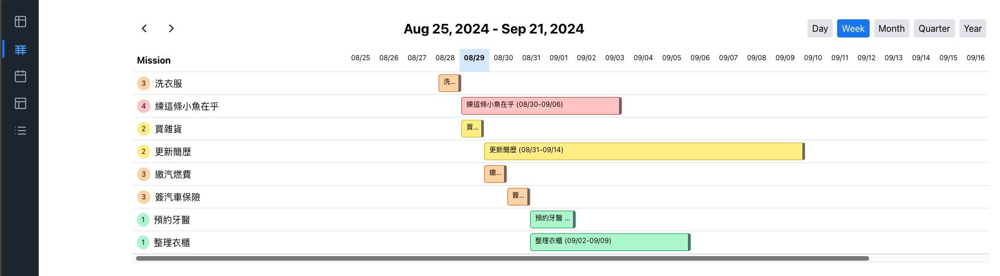
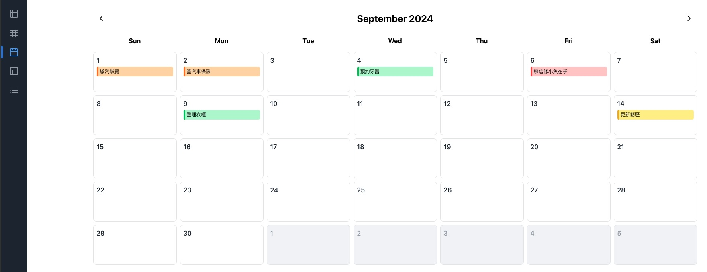
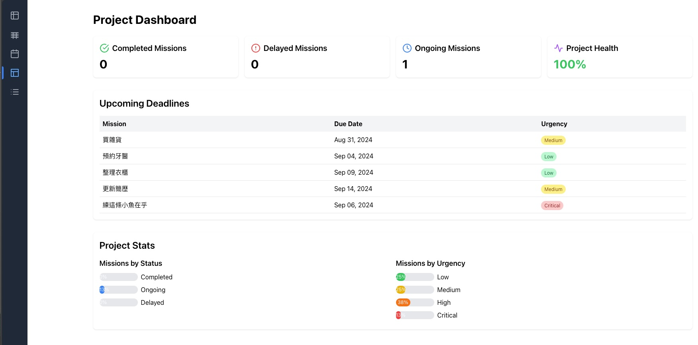
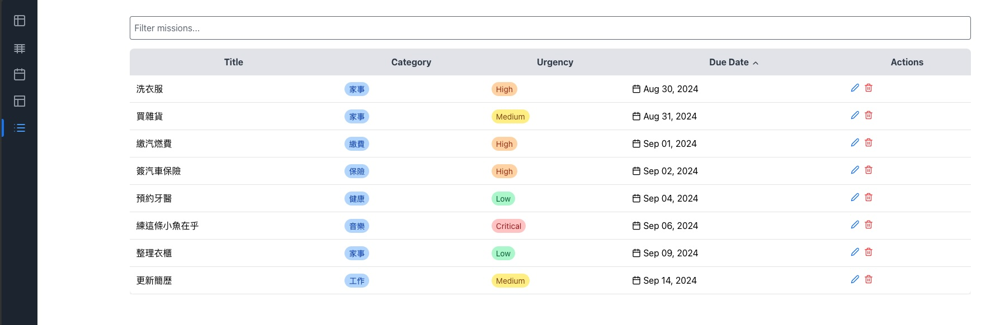

# 簡介

> 因為同時擔任 PM 與 Developer 的關係，事務繁忙，在公司內沒有良好的工作管理工具，且甘特圖要自己手刻。
> 
> 同時因為最近專案有前端的需求，剛好可以練習 react，於是就決定，走一個。

--- 
## 主畫面
+ Kanban

+ Gantt

+ Calendar

+ Dashboard

+ List

--- 
## Tech Stack
### 後端
+ .NET 8
### 前端
+ React Typescript
### 架構
+ Clean Architecture
    + **Api Layer:**
        + Controller 結構
        + 使用 Web API 來做為對外接口。
    + **Application Layer:**
        + 使用 CQRS 模式來區分查詢 (Query) 和命令 (Command)。
        + 利用 MediatR 統一發動事件。
        + 提供 AuthorizationService: 對對應的 Permissions、Roles、Policies 給予權限。
        + 提供 ValidationService: 檢查 command 是否有符合規範。
    + **Domain Layer:**
        + 包含實體 (Entities)、值物件 (Value Objects)、聚合根 (Aggregates) 和領域事件 (Domain Events)。
        + 負責核心業務邏輯和規則。
    + **Infrastructure Layer:**
        + 處理資料存取，在此為對資料夾作 I/O。
        + 負責外部服務 (例如身份驗證) 的整合。
## 功能需求
### 身份驗證:
+ 使用 Windows 認證來辨識公司內部用戶，確保只有授權用戶能夠存取和操作資料。
### 頁面結構
+ Kanban 看板
+ Calendar 月曆
+ Gantt 甘特圖
+ List 列表
+ Dashboard 儀表板

### 待辦清單
+ Kanban
    - [x] 新增看版
    - [x] 新增卡片
    - [x] 卡片拖曳
    - [x] 看板拖曳
    - [x] 卡片刪除
    - [x] 看板刪除
    - [x] 編輯卡片
    - [x] 看板排序
    - [x] 卡片排序
    - [ ] 支援 Markdown
+ Calendar
    - [x] 主畫面
+ Gantt
    - [x] 主畫面
    - [x] 拖曳調整
    - [ ] 演算法
+ List
    - [x] 主畫面
    - [x] 搜尋
+ Dashboard
    - [x] 主畫面
    - [x] 健康度計算